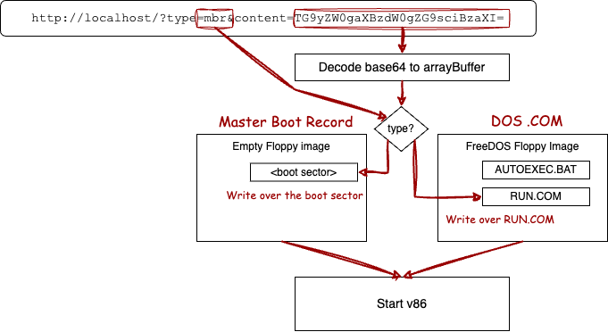
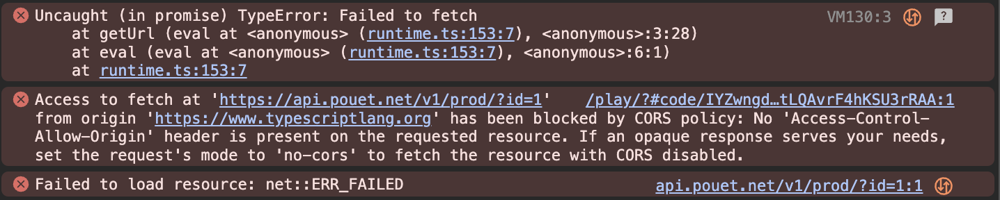
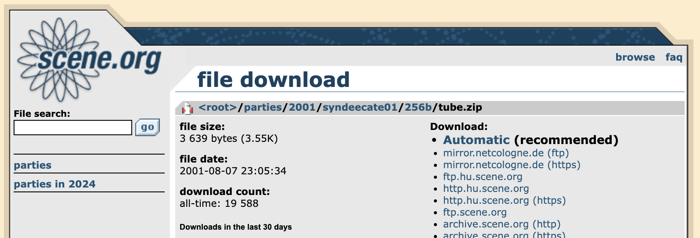

# 2,629 Tiny Demos from Pouet, Running in the Browser

This website is a gallery of tiny demos scraped from demoscene aggregator [pouet.net](https://pouet.net), all MS-DOS .COM files smaller than 1024 bytes, emulated in the browser for your casual enjoyment. Some are [stunning](?which=88198), some more [basic](?which=52630), some [interactive](?which=61245). Some are [weird](?which=4661), some [don't work](?which=63118), and others straight up [crash the emulator]().

But there are a lot of gems in there, and it's all there to click around and enjoy without the hassle of loading them into an emulator.

## Why I Made This

It wasn't my original idea to build this gallery. Originally, I just wanted to upgrade [Demo Baker](https://parkertomatoes.github.io/demobaker/build.html).

Back in 2020, I had a dim flicker of brain cell activity: I saw "fits in a tweet" sites like [dwitter](https://www.dwitter.net/), the Windows 95 ["app"](https://github.com/felixrieseberg/windows95) was fresh in memory, and cool [boot sector](https://github.com/nanochess/Pillman) games were getting on HackerNews, and thought "how come no one's made an app-in-a-tweet site for x86?". Turns out [they did](https://github.com/AntoineViau/tweetx86), 
but I didn't notice at the time.

So I barrelled ahead and built a web-app that took an entire 512 bytes boot sector demo, encoded it as base64,
and embedded it a URL:

The site ran completely client-side from GitHub static pages, and allowed me to share links on forums to playable browser demos of interesting MBR and DOS demos I found, without needing any server-side storage. The whole x86 app fits in a [link](https://parkertomatoes.github.io/demobaker/?type=com&content=uBMAzRD8uACgjtiOwL7BAr8gFC6tkbvwANHhuBg3cwO4OALoIgAB34PrEHJP6BgAKd%2BD7wjr4q2XrYTkk7AwUMZE%2FwLorgBYUFNRV1C7eQIu15O5CACI%2BNDjcgIxwID%2FEHIHgD0OdJgyBari6YHHOAFYQKgHddVfWVtYw4HHiAmB%2FusCdY2xBbgCAC6lq%2BL7tADNGjsWBPp09okWBPq0Ac0WtAB0As0WiOA8AXUCzSAsSHIMPAlzCLv1Ai7Xov75viDmrZetkzHA6CsAgDb%2F%2BYC4KA54B6Ai5rED0uDoaP%2B9NwG3If%2FVty7%2F1bco%2F9W3NP%2FV65t0A%2BhO%2F4n4MdK5QAH38YjUCMSA5Ad1WrU3OG3%2FEOQ4rQAKEOQ4bQgQ5DitwP4Q5IT%2FdCv2wwV0DDsWAPqwAnIMsAjrCDwAsARyArABhMR1I4jYhMR1HdDodfiwCOv0iRYA%2Bi6iOgKg%2FvmExHUGINx0GojYiET%2BqAW7gP11A7sCAKgMdAL32wHfiXz8wwBC5%2Bf%2F%2F348PH788PD8fjz%2F%2F%2F%2F%2F%2F%2F%2F%2F%2Fzx%2B%2F%2F%2Fn50IAPH7%2F%2F%2F%2F%2Ffjw8ftvb%2F%2F%2F%2FpQAAABgYAAAAPH4%2FDw8%2FfjwAAP5%2FAkICQv9%2FQEJ%2BfgICfwLAA0ACfwJAAv5%2FAkL%2Fe0AKfn4CQP9%2FAACYqpBQmGSgPKhQAQAACAACAAAE&name=Pillman%20(by%20nanochess))!

## Trying (And Failing) To Make It Even Easier

This year I set out to upgrade Demo Baker to use the new, dynamic WASM version of V86, improve the presentation a bit, and allow things like titles.

But I thought, 90% of the things I use this app for comes from [pouet.net](pouet.net). What if you could just drop in a URL from a product page and automatically run the demo?

Even better, pouet has an [API](https://api.pouet.net/)!

So I scripted up a test to run the demo, and... remembered why CORS exists:


pouet's API server doesn't support cross-origin browser requests, so API calls from my website to theirs won't work. And I'm too cheap and lazy to write a proxy - I want all this to be hosted statically from Github pages. So, plan A is out.


## What if I just cached all the demos?

1,000 tiny demos are still tiny. If I downloaded 10,000 1k demos from Pouet, the result would be about 10MB, which doesn't sound terrible. So, plan B: What if you provided the URL, and the app fetched the appropriate demo from a secret cache?

The owners of pouet, wonderful people that they are, also provide a weekly [data dump](https://data.pouet.net) of their product index. That
archive was 300MB though, too big to host in a GitHub page, so a little cleaning was needed. I wrote a NodeJS script to go through the giant JSON file and:

 * Filter out demos that are larger than 1k and not DOS-based
 * Strip out unneccessary metadata
 * Follow the embedded link to download the demo
 * Encode the demo in base64 and stuff in the JSON

Pretty straightforward... except when it wasn't: 
 * Many of the downloads are in .zip, .rar, .7z, .arj archives, etc.
 * Some archives didn't have COM files or had COM files larger than 1k
 * Many demos were linked to an _HTML_ page like this: 
   
 * Many links were broken/unsafe/etc

But all that could be worked around. When filenames had an archive extension, I used a [NodeJS 7zip binding](https://github.com/onikienko/7zip-min) to search them for .COM files. scene.org has beautifully static and easy to scrape HTML, so if a URL contains "scene.org" the script follows the link. And it has _lots_ of corner case handlers for missing .COM files, bad links, etc.

In the end, 2,629 demos were successfully fetched and stored in a JSON that was about 1.411 MB long, just enough to fit on a 3.5" floppy. 

```json
[
    {
        "name":"HaNsA KaOs",
        "id":"698",
        "content":"uBMAzRB...zRC0TM0hAAAA"
    }, {
        "name":"Bump Is Possible",
        "id":"1380",
        "content":"kLkAEIzIAu...sPSTs"},
    }, 
    /* ... +2,627 entries */
]
```

## From A Cache To Gallery

When you visit the [old version](https://parkertomatoes.github.io/v86/) of the demo baker page, it automatically started playing the boot sector pillman game by nanochess. Classic boot sector feat, but a little boring after 100 refreshes. So instead I rigged it to play a random demo from the index, and... 


_[lyuk](https://www.pouet.net/prod.php?which=51780) by [Exceed](https://www.pouet.net/groups.php?which=2)_

Cool. Refresh....


_[HYDRAULIC PIXELS](https://www.pouet.net/prod.php?which=86931) by [Astroidea](https://www.pouet.net/groups.php?which=18)_

_Is that depth of field!?_ Refresh...


_[Blobs](https://www.pouet.net/prod.php?which=4034) by [Proxium](https://www.pouet.net/groups.php?which=95)_

_Psychodelic_. Refresh...

This went on for an hour before I realized, this random demo should be the whole thing. I built a gallery with back, random forward buttons, the title of each demo, and a link back to the pouet page. An `<input>` with `<datalist>` served as a good enough search bar to look demos up by title.

## One Last Task - Attribution

At this point, I realized there really needs to be a link on each demo to the author's page. So, I wrote one last script to augment the demo list with the author using the original data dump. But it turns out the "author" field is pretty complicated:
 * The demos can have one or more groups
 * The demos can have one or more people in "credits"
 * If nothing else, the demo has an uploader

## Wrapping Up

I'm unreasonably happy with this throwaway project - I'm Pygmalion over here. Staring at a random parade of tiny demos is incredibly hypnotic and beautiful. 

Not all the demos work well, many have palette issues and some trigger illegal opcode errors. But this has actually help me find a few issues to improve v86. 

Copyright is reserved by the creators. Legally, I consider this site an archive, like [demozoo](https://demozoo.org/), or [scene.org](https://scene.org/), or [youtube]() which already host all these demos. Its new purpose is to help you discover, appreciate, and learn more about forgotten, somewhat modest, but still extremely cool old demos.

This is a one-off project for me and I don't intend to update the list  week to week. If a demo author finds their work here and doesn't want it here, please file a github issue and I'll promptly remove it.

Now, please enjoy this [rotating 3d hat](https://parkertomatoes.github.io/demo-parade/?which=71639)